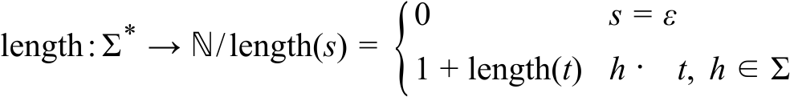

:tree-block-type: listing

== Operaciones de Strings

Este trabajo tiene tres partes, una de análisis comparativo, otra de desarrollo de operaciones, y una última de programas que aplican las operaciones desarrolladas.

El análisis comparativo es sobre el tipo de dato String en el lenguaje de programación C versus otro lenguaje de programación a elección; mientras que el desarrollo está basado en los ejercicios 20 y 21 del Capítulo #1 del Volumen #1 de <<MUCH2012>>, que a continuación se transcribe:

[sidebar]
****
Investigue y construya, en LENGUAJE C, la función que realiza cada operación solicitada: +

+*+ Ejercicio 20 * +
(a) Calcula la longitud de una cadena; +
(b) Determina si una cadena dada es vacía. +
(c) Concatena dos cadenas.

+*+ Ejercicio 20 * +
Construya un programa de testeo para cada función del ejercicio anterior.
****

=== Temas
* Lenguajes formales.
* Especificación de operaciones.
* Interfaces.
* Proceso de traducción.
* `make`
* Strings.
* Alocación.
* Tipos.

=== Objetivos

==== Parte I -- Análisis Comparativo del Strings en Lenguajes de Programación

Realizar un análisis comparativo de dato String en el lenguaje C versus un lenguaje de programación a elección.
El análisis debe contener, por lo menos, los siguientes ítems:

. ¿El tipo es parte del lenguaje en algún nivel?
. ¿El tipo es parte de la biblioteca?
. ¿Qué alfabeto usa?
. ¿Cómo se resuelve la alocación de memoria?
. ¿El tipo tiene mutabilidad o es inmutable?
. ¿El tipo es un __first class citizen__?
. ¿Cuál es la mecánica para ese tipo cuando se los pasa como argumentos?
. ¿Y cuando son retornados por una función?
. ¿Qué nivel de soporte tiene para __ASCII__, __Unicode__, y __UTF-8__?

Las anteriores preguntas son disparadores para realizar una análisis comparativo profundo.

==== Parte II -- Biblioteca para el Tipo String

Desarrollar una biblioteca con operaciones de strings.
El desarrollo implica especificar las operaciones e implementar su parte pública y privada.

* Operaciones de consulta, no crean ni mutan:
. _IsEmpty_
. _GetLength_
. _AreEqual_
. _AreDecimalDigits_
. _Contains_ indica si una cadena dada tiene un caracter dado.
. _ToInteger_ que interpreta una cadena como un entero, asume que la cadena es correcta.
. Una operación a definir libremente. 

* Crédito extra: Operaciones de creación ó mutación.
. _Concatenate_
. _Power_ ó _Potenciar_
. Una operación a definir libremente. 

El orden del desarrollo es el siguiente:

. Especificación en `Strings.md`.
. Codificación de la interfaz en `Strings.h`.
. Codificación de las pruebas en `StringsTest.c`.
. Implementación en `Strings.c`.

****
Para debatir en el equipo.

¿Es correcto que _ToInteger_ sea parte de la biblioteca de __Strings__?
¿Debería ser parte de otra biblioteca implementada en, por ejemplo,
_Conversion.h_ y _Conversion.c_ y tener su propio programa de prueba _ConversionTest.c_?
****

===== Restricciones
//   (|s|="GetLength"(s)="len"(s)="lenght"(s)),
- La especificación matemática debe seguir esta estructura:
+

- Las pruebas deben realizarse con `assert`, 
deben utilizar _literales cadena_ y no variables, 
y no deben enviar nada a `stdout` ni a otro flujo.
- Los prototipos deben utilizar `const` cuando corresponde.
- Las implementaciones de las operaciones de Srting no deben utilizar funciones estándar, por ejemplo, las declaradas en `<string.h>`.
- Por lo menos una operación debe implementarse con recursividad.
- Codificar el `Makefile` para que el comando `make test` corra los tests.

==== Parte III -- Programas con argumentos de línea de comando
Esta última parte  consiste en desarrollar una serie de programas que esperan argumentos en su línea de comandos.
Todos los programas envían su salida a `stdout`.

- `enlineas`: Muestra cada argumento en una línea propia.
- `longitudes`: Longitud de cada argumento.
- `mayorlongitud`: Argumento con mayor longitud.
- `todosiguales`: Uno si son todos los argumentos iguales, si no, cero.
- `suma`: suma de todos los argumentos que son enteros en base 10. Variación: signo opcional y otras bases

=====  Restricciones
- Se deben usar el o los módulos desarrollados en la anterior parte.
- No se deben usar funciones estándar de cadenas o conversión.
- Para iterar, se debe usar `for`, no `while` y no debe usar variables índice.
- Codificar el `Makefile` de manera que el comando `make` genere todos los ejecutables.

=== Tareas
. Parte I:
Escribir el `AnálisisComparativo.md` con la comparación de strings en C versus otro lenguaje de programación a elección.

////
La parte pública de la biblioteca se desarrolla en el header `"String.h"`, el cual no debe incluir `<string.h>`.
El programa que prueba la biblioteca, por supuesto, incluye a `"String.h"`.
////
. Parte II
.. Para cada operación, escribir en `Strings.md` la especificación matemática de la operación, con conjuntos de salida y de llegada, y con especificación de la operación.
.. Escribir el `Makefile`.
.. Por cada operación:
... Escribir las pruebas en `StringsTest.c`.
... Escribir los prototipos en `String.h`.
... Escribir en `String.h` comentarios con las precondiciones y poscondiciones de cada función, arriba de cada prototipo.
... Escribir las implementaciones en `Strings.c`.
.. Probar con `make test`.

. Parte III:
.. Escribir y probar los siguientes programas:
- `enlineas`.
- `longitudes`.
- `mayorlongitud`.
- `todosiguales`.
- `suma`.
.. Actualizar `Makefile`.

=== Productos
[{tree-block-type}]
--
01-Strings
|-- readme.md
|-- AnálisisComparativo.md
|-- String.md
|-- Makefile
|-- StringTest.c
|-- String.h
|-- String.c
|-- Conversion.h     // Depende de la decisión del equipo
|-- Conversion.c     // Depende de la decisión del equipo
|-- ConversionTest.c // Depende de la decisión del equipo
|-- enlineas.c
|-- longitudes.c
|-- mayorlongitud.c
|-- todosiguales.c
`-- suma.c
--

=== Referencias
- <<KR1988>> B.6 Diagnósticos: `<assert.h>`
- <<Interfaces>> Interfaces: Los Contratos entre Proveedores y Consumidores
- <<KR1988>> 5.10 Argumentos de la línea de comandos.
